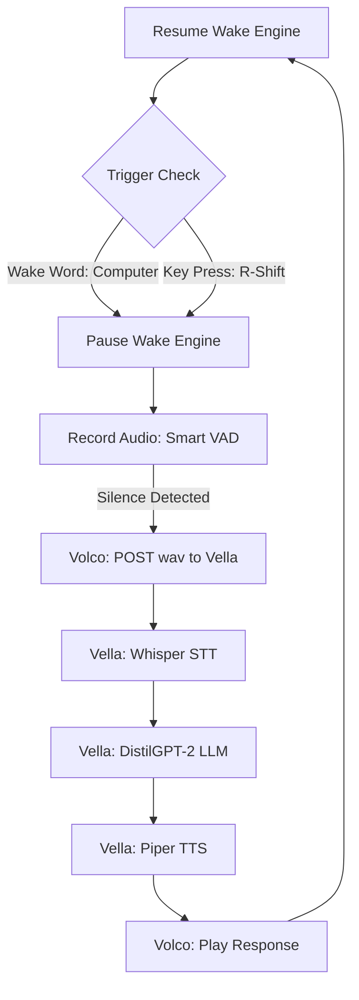

---

# 🎙️ Volco V1.5: Hybrid Smart Assistant

**Volco** has evolved into a fully functional, hybrid-activation AI thin-client. It now features **Dual-Trigger Activation** (Wake Word + Push-to-Talk) and a complete **STT ➔ LLM ➔ TTS** pipeline powered by the Vella Server.

> **Status:** V1.5 Hybrid Pipeline Verified ✅
> **Goal:** High-speed, natural interaction with zero intelligence handled locally.

---

## 🧠 The Architecture: The AI Nervous System

Volco now operates as a real-time conversational interface with "Hybrid Ears." It actively listens for a keyword OR a manual trigger.

* **Volco (Client):**
* **Hybrid Wake System:** Runs `Porcupine` (Wake Word) and `Keyboard` listeners in parallel.
* **Smart VAD:** Uses RMS energy detection to auto-stop recording when you finish your sentence.
* **Debounced State Machine:** Prevents accidental dual-triggers.


* **Vella (Server):**
* **Ear (Whisper):** Transcribes audio to text (`faster-whisper`).
* **Brain (DistilGPT-2):** Generates contextual responses.
* **Voice (Piper TTS):** Synthesizes natural-sounding speech.


---

## 🛠️ Updated Pipeline Flow



VOLCO/
│
├── main.py                 # THE DISPATCHER: Listen for Wake Word / Buttons
├── test_audio.py           # Hardware debugger
│
├── config/                 # Shared settings (server URLs, API keys, etc.)
│   ├── settings.json       
│   └── config_manager.py   
│
├── core/                   # SHARED HARDWARE DRIVERS
│   ├── audio_io.py         # Shared Mic/Speaker control
│   ├── connection.py       # Brain (Server) communication
│   └── wake_word.py        # Constant wake word listener
│
├── modes/                  # ⚡ THE TWO PERSONALITIES
│   │
│   ├── ai_mode/            # THE SMART BRAIN
│   │   ├── session.py      # Logic for Vella conversation (the current logic)
│   │   └── action_handler.py # Handles specific AI triggers (Spotify, Calls)
│   │
│   └── bt_mode/            # THE DUMB HEADPHONE
│       ├── media_sink.py   # Handles incoming Bluetooth audio from phone
│       └── avrcp_control.py # Handles Play/Pause/Skip commands
│
└── assets/                 # Shared UI Sounds and Models
    ├── models/             
    └── sounds/


---

## 📂 Project Structure

| File | Responsibility |
| --- | --- |
| `volco_hybrid.py` | **The Body:** Handles Wake Word (Porcupine), Push-to-Talk, and Audio I/O. |
| `main.py` | **The Brain:** FastAPI server managing the AI pipeline (`/volco_process`). |
| `vector_store.py` | **The Memory:** Handles embedding and retrieval for context. |
| `chat_agent.py` | **The Logic:** Interface for the local LLM (DistilGPT-2). |
| `assets/` | Audio cues (`ding.wav`) for wake-word feedback. |

---

## 🚀 Key Features in V1.5

### 1. Hybrid Activation (New!)

Volco is now hands-free *and* hands-on.

* **Wake Word:** Say **"Computer"** to activate instantly (powered by `pvporcupine`).
* **Push-to-Talk:** Hold **Right Shift** for noisy environments or discrete commands.

### 2. "Response-Only" Synthesis

The pipeline is optimized to prevent "Echoing." The server strips the prompt instructions and only sends the AI's actual answer back to the client, saving bandwidth and improving naturalism.

### 3. Modular Local Hosting

Everything runs offline on the V: drive.

* **Whisper:** `faster-whisper-small` for near-instant transcription.
* **LLM:** `distilgpt2` for low-latency text generation.
* **TTS:** `Piper` (Low Quality) or `Coqui` (High Quality) for synthesis.

**To activate backend:**

```bash
uvicorn vella_server:app --reload --host 0.0.0.0 --port 8000

```

---

## 🗺️ The Roadmap to V2

* [ ] **Contextual Memory:** Fully integrate Vector Store (ChromaDB) so Volco remembers previous turns.
* [ ] **Interruptibility:** Allow the user to "barge in" and stop the AI from talking.
* [ ] **Hardware Integration:** Migration to Raspberry Pi Zero 2W with a custom HAT.
* [ ] **Brain Upgrade:** Swap DistilGPT-2 for **TinyLlama-Chat** or **Phi-2** for more intelligent conversation.